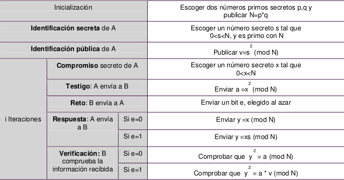

**Autor: Aarón Socas Gaspar**

# ALGORITMO DE FIAT-SHAMIR

##Objetivo

Implementar la demostración de conocimiento nulo de Fiat-Shamir.

##Desarrollo



##Ejecución

Antes de nada debemos compilar:
`
    g++ main.cpp fs.cpp -o fs (o salida que deseen)
`

Para ejecutar en Linux:
`
    ./fs (o nombre de salida escogido)
`

##Ejemplos

**Ejemplo1**

1. Entrada:
``` 
    a. p=7, q=5
    b. s=3
    c. i=2 (número de iteraciones)
    d. 1a iteración: x=16, e=0
    e. 2a iteración: x=2, e=1
``` 
2. Salida:
```
    a. N=35
    b. v= 9
    c. 1a iteracion: a = 11, comprobar que 16^2 = 11 (mod 35) y dar por válida la iteracion
    d. 2a iteración: a= 4, y = 6, comprobar que 6^2 = 4*9 (mod 35) y dar por válida la iteración
```

**Ejemplo 2**

1. Entrada:
```
    a. p = 683, q = 811
    b. s=43215
    c. i=1 (número de iteraciones)
    d. 1a iteración: x=16785, e=1
```

2. Salida:
```
    a. N=553913
    b. v= 295502
    c. 1a iteración: a= 348421, y = 291658, comprobar que 291658 = 348421*295502 (mod 553913) y dar por válida la iteración
```
 
--------------------------------------------------------------------------
*Aarón Socas Gaspar- Seguridad de Sistemas Informáticos (Curso 2013-2014)*